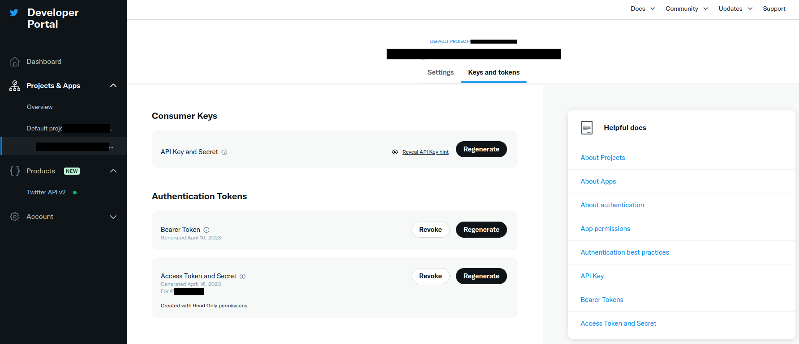

# Twitter Scraper using Tweepy
This is a Python program that allows you to scrape tweets from Twitter using the Tweepy library.

Note that in order to use the advanced features of the Twitter API, a `BASIC` subscription is needed. More information on the pricing can be found on the [official Twitter products page](https://developer.twitter.com/en/products/twitter-api).

## Setup
1) To use this program, you need to have a Twitter Developer account. If you don't have one already, go to [developer.twitter.com](https://developer.twitter.com) and apply for a developer account.

2) Once you have a developer account, create a new project and an associated Twitter app. This will give you access to the consumer key and consumer secret needed for authentication.

3) After creating the app, generate an access token and access token secret from the "Keys and Tokens" section of your Twitter Developer Dashboard. You will need these tokens for authentication as well. Following image shows where these keys can be generated.





4) Install Tweepy and OpenPyXl by running the following command in your terminal or command prompt:

```sh
pip3 install tweepy openpyxl
```
## Usage
1) Open the `twitter_scraper.py` file in your Python editor of choice.

2) Replace the placeholders `[YOUR CONSUMER KEY]`, `[YOUR CONSUMER SECRET]`, `[YOUR ACCESS TOKEN]`, and `[YOUR ACCESS TOKEN SECRET]` with the corresponding values from your Twitter app.

3) Modify the query variable to specify the search query for the tweets you want to scrape.

4) Run the program.

```sh
python twitter_scraper.py
```
5) The program will save the scraped tweets to a CSV file named tweets.csv in the same directory as the `twitter_scraper.py` file.

## Notes
Twitter imposes limits on how frequently you can scrape tweets, so be sure to check the Twitter API Rate Limits documentation and adjust your code accordingly.

Tweepy provides additional functionality beyond the basic scraping demonstrated in this program. Check out the [Tweepy documentation](https://docs.tweepy.org/en/stable/) for more information.