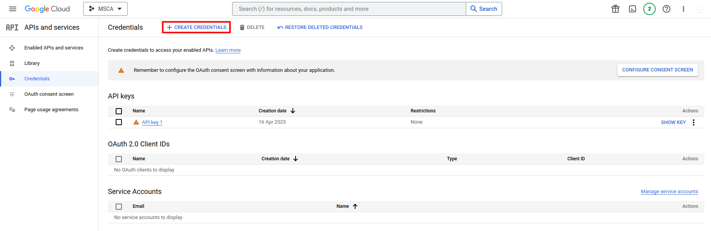

# YouTube Comments Scraper using YouTube API
This Python program allows you to scrape comments from a YouTube video using the YouTube API.

## Setup
1) To use this program, you need to have a Google account and enable the YouTube Data API v3 for your project. If you haven't enabled the API already, go to the [Google API Console](https://console.cloud.google.com/apis/library/youtube.googleapis.com) and enable the API.

2) Once you've enabled the API, create a new API key from the "Credentials" section of your Google API Console. This will give you access to the API key needed for authentication. The image below shows where to create the credentials.



3) Replace the `[YOUR API KEY]` placeholder with the API key you obtained in the previous step.

4) Replace the `[YOUR VIDEO ID]` placeholder with the video ID of the YouTube video you want to scrape comments from.

5) Install `OpenPyXl` and the `Google API Python client library` by running the following command in your terminal or command prompt:

```sh
pip3 install openpyxl google-api-python-client
```

6) If you want to use the provided Jupyter notebook, run following command

```sh
pip3 install jupyterlab
```
## Usage

### As Python Script
1) Open the `youtubescraper.py` file in your Python editor of choice.

2) Modify the `VIDEO_ID` variable to specify the video ID of the YouTube video you want to scrape comments from.

3) Run the program.

```sh
python youtubescraper.py
```
4) The program will save the scraped comments to an Excel file named `[VIDEO_ID].xlsx` in the same directory as the `youtube_comments_scraper.py` file.

### As Juypiter Notebook

- Open the notebook

## Explanation

This script is written in Python and uses the openpyxl library to create an Excel file containing comments from a specified YouTube video using the YouTube Data API.

1) Firstly, the script imports the necessary modules including openpyxl, the Google API Python client library, HttpError from googleapiclient.errors, and datetime.
2) The script then sets two variables, API_KEY and VIDEO_ID, which are used to access the YouTube Data API and specify which video to retrieve comments from.
3) The script creates a YouTube API client object and uses it to retrieve comments for the specified video by calling the commentThreads().list() method with a number of parameters, including part, videoId, textFormat, pageToken, and maxResults. The method returns a JSON object containing the comments data, including comment text, author, creation date, and number of likes.
4) The script then extracts the comment data from the JSON object and adds it to a list named "comments". This is achieved by iterating through each item in the response object's "items" field, which corresponds to a single comment thread. For each thread, the script extracts the comment text, author name, creation date, and number of likes from the JSON object and appends it to the "comments" list.
5) The script then checks if there are more comments to retrieve by checking if the "nextPageToken" field is present in the response object. If it is, the script sets the next_page_token variable to the value of the "nextPageToken" field, which is used in the next iteration of the loop to retrieve the next page of comments.
6) If an HTTP error occurs during the API call, the script prints an error message and breaks out of the loop.
7) Next, the script creates a new Excel workbook using the openpyxl.Workbook() method and creates a new worksheet named "Comments". The script also adds column headings for the comment text, author name, creation date, and number of likes to the worksheet using the worksheet.append() method.
8) Finally, the script iterates through each comment in the "comments" list and appends it to the worksheet using the worksheet.append() method. The script then saves the Excel file with the name "{VIDEO_ID}.xlsx", where VIDEO_ID is the ID of the YouTube video specified at the beginning of the script.

## Notes
The YouTube API imposes limits on how frequently you can retrieve comments, so be sure to check the [YouTube API Quota Calculator](https://developers.google.com/youtube/v3/determine_quota_cost) and adjust your code accordingly.

This program retrieves comments from a single video. If you want to scrape comments from multiple videos, you will need to modify the program to loop over a list of video IDs. Check out the [YouTube API documentation](https://developers.google.com/youtube/v3/docs/comments/list) for more information on retrieving comments from multiple videos.